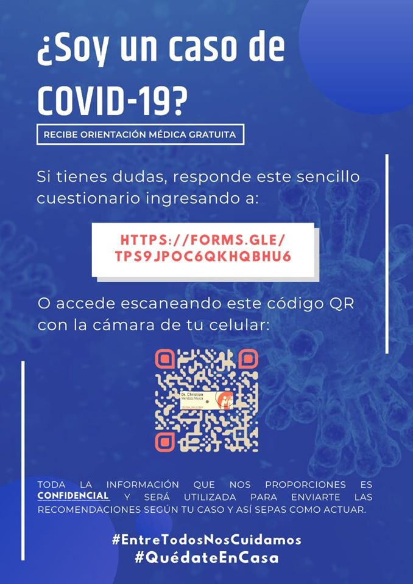

## Cuestionario ¿Soy un caso de COVID-19? por EQUIPO COVID-19 GDL

### Introducción

El proyecto de atención ciudadana con orientación de la severidad de los síntomas por sospecha de infección por COVID-19 es un esfuerzo de universitarios, incluidos profesores y alumnos en la generación de una herramienta de atención y con el único objetivo de evitar que el sistema de salud colapse y sobrepase la situación que se vive alrededor del mundo.

Actualmente esta herramienta utiliza Google Survey, con un cuestionario elaborado por el Residente de Infectologia del HCG FAA **Dr. Christian Mendoza Mujica**, esta iniciativa fue respaldada por una comunidad de estudiantes y profesores afines al proyecto.

### Acceso al test:

El acceso a la herramienta es el siguiente: [https://forms.gle/tPs9jPoc6qkhQbHu6](https://forms.gle/tPs9jPoc6qkhQbHu6)

### Métodos y privacidad
La herramienta consta de 27 reactivos, colecta datos clínicos, demográficos, datos de contacto y ubicación geográfica, la información vertida es opcional a excepción del email (es nuestro medio de contacto) y quien contesta nuestro cuestionario esta accediendo a su recopilación, la información será exclusiva para recibir orientación y no será utilizada con fines comerciales o ilegales.

Puedes consultar nuestro aviso de privacidad aquí: [Aviso de Privacidad](https://covid19gdl.github.io/privacidad)

Se clasifican por severidad estratificada por puntajes:

* Riesgo Bajo →  Puntuación 0-3 : Medidas generales y cuidados
* Riesgo Intermedio 3→  Puntuación 4-6 : Aislamiento por 14 días y medidas generales
* Riesgo Alto → Puntuación >7 : Necesidad de atención inmediata en servicios de salud

### Reto actual:

Actualmente hemos contestado cerca de 6,000 solicitudes (21/03/2020).

Somos actualmente 150 voluntarios que estamos trabajando 24 horas por contestar estas solicitudes.

Queremos que este proyecto beneficie a la comunidad universitaria y la sociedad  de Jalisco.

### Gracias

Dr. Netzahualpilli Delgado Figueroa

Coordinador Logístico del Proyecto

